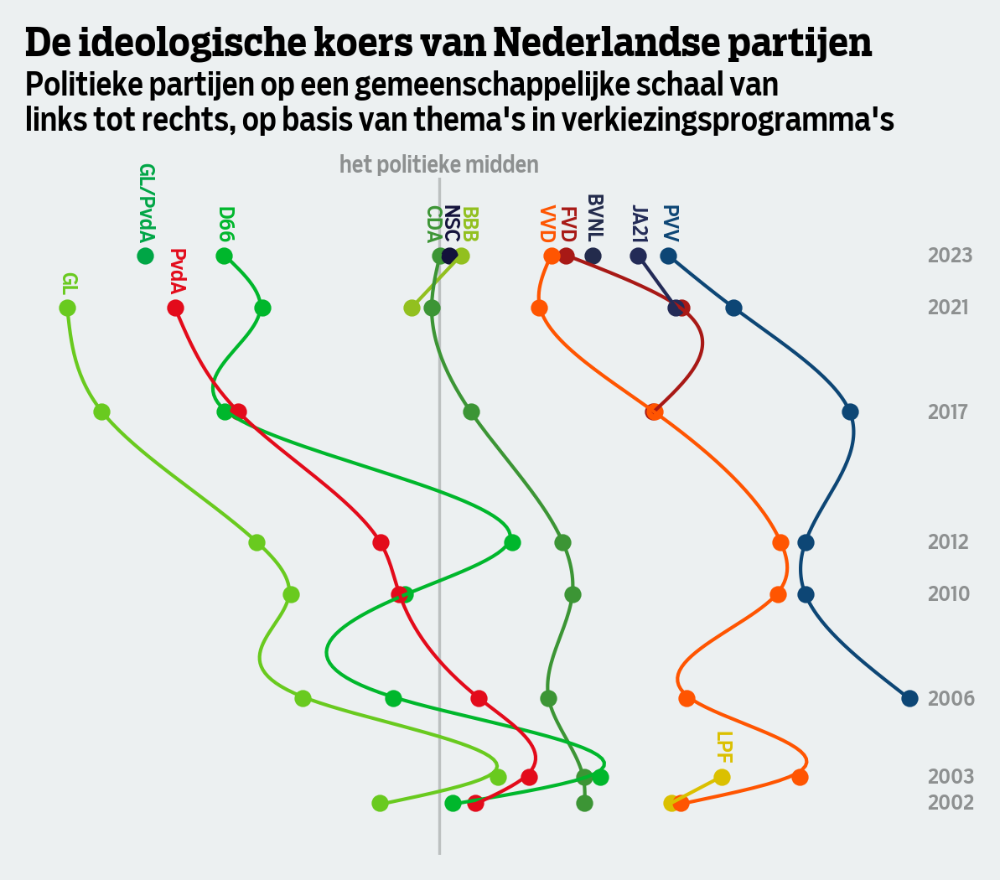

# De strijd op rechts

Met NSC, BBB, CDA, JA21, BVNL, VVD, FvD, SGP en PVV is het dringen aan de rechterkant van het politieke spectrum. Om te zien hoe die strijd zich voltrekt, nam De Groene Amsterdammer samen met Data School de landelijke verkiezingsprogramma’s sinds 2000 onder de loep. In deze repository vind je de code voor dit onderzoek. De analyse is uitgevoerd in vijf notebooks, die in die volgorde moeten worden gedraaid.

<picture>
  
</picture>

